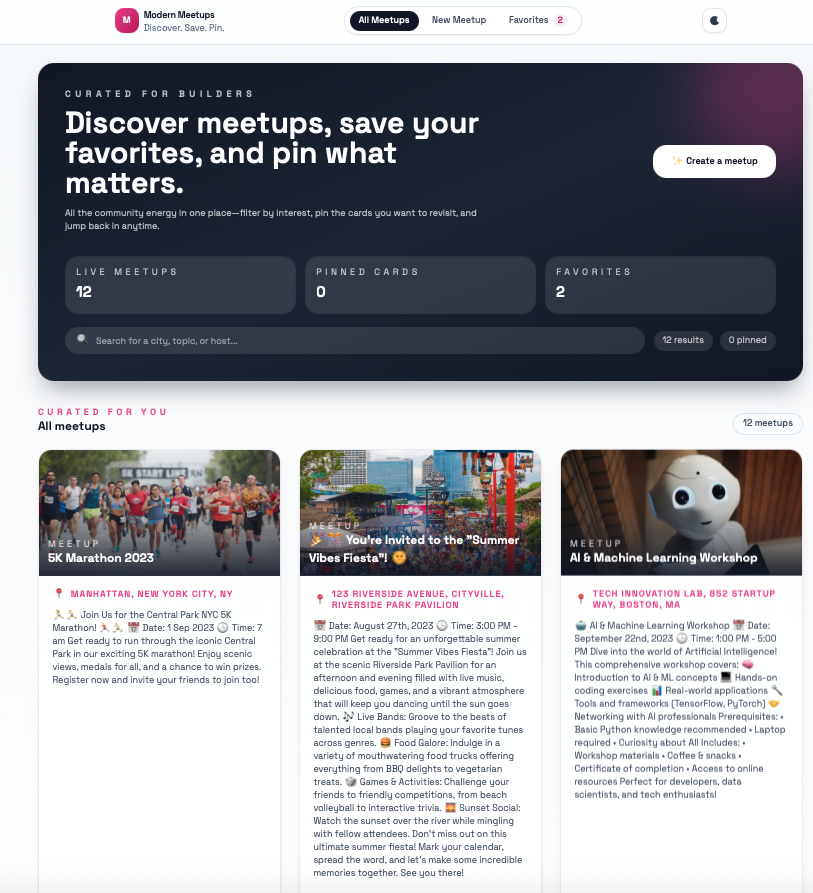
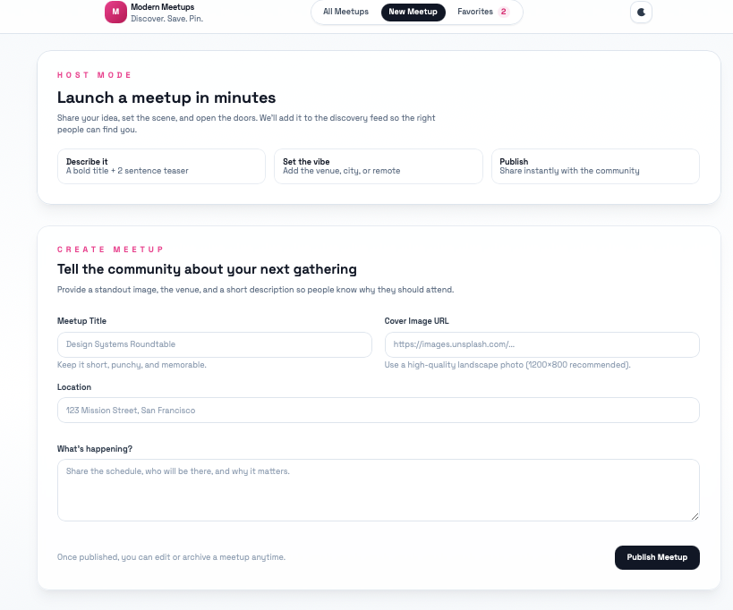
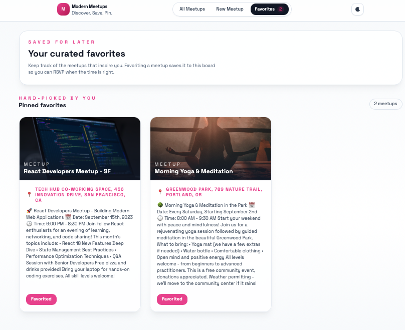

# Modern Meetups

A modern, theme-aware meetup board built with React 18, React Router 6, Tailwind CSS, and Firebase Realtime Database. Create, edit, pin, favorite, and delete events through a polished UI that works in both light and dark mode.



## ✨ Features
- **Hero discovery dashboard** with live stats, search, and quick access to creating new meetups.
- **Dark mode toggle** powered by a custom theme context (remembers your preference in `localStorage`).
- **Pin & favorite system** so you can highlight must-see meetups while keeping a personal favorites board.
- **Full CRUD**: create, edit, and delete meetups. Edits reuse the same form with prefilled data, and deletes instantly remove pins/favorites.
- **Responsive cards** with management actions (pin, favorite, edit, delete) and stateful button feedback.
- **Tailwind-only styling** for fast iteration and consistent design tokens.

## 🛠️ Tech Stack
- React 18 (Create React App)
- React Router DOM 6
- Tailwind CSS 3 (JIT, dark-mode class strategy)
- Context API for Favorites & Theme state
- Firebase Realtime Database (REST + SDK bootstrap)

## 🚀 Getting Started
```bash
git clone <repo>
cd react-meetups
npm install
```

### Environment Variables
Create a `.env` file in the project root (or update the existing one) with your Firebase credentials:

```bash
REACT_APP_FIREBASE_API_KEY=...
REACT_APP_FIREBASE_AUTH_DOMAIN=...
REACT_APP_FIREBASE_DATABASE_URL=https://<PROJECT>.firebaseio.com
REACT_APP_FIREBASE_PROJECT_ID=...
REACT_APP_FIREBASE_STORAGE_BUCKET=...
REACT_APP_FIREBASE_MESSAGING_SENDER_ID=...
REACT_APP_FIREBASE_APP_ID=...
```

> Need help gathering these? See `FIREBASE_SETUP.md` for step-by-step screenshots plus export/import tips (you can seed the DB with `react-meetups-71be7-default-rtdb-meetups-export.json` via Firebase’s import dialog).

### Local Development
- `npm start` – CRA dev server on `http://localhost:3000`.
- `npm test` – Jest watcher (useful for component/unit tests).
- `npm run build` – Production bundle (used to verify regressions after changes).

## 🌐 Firebase Integration
- All meetups are stored under the `/meetups` collection in Realtime Database.
- REST helpers (`src/config/firebase.js`) expose:
  - `FIREBASE_ENDPOINTS.meetups` – collection CRUD (`GET`/`POST`).
  - `FIREBASE_ENDPOINTS.meetupById(id)` – single document operations (`PATCH`/`DELETE`).
- The UI assumes public read/write during development. Before shipping, update your RTDB rules or add auth + tokens.

## 🧭 App Tour
- **All Meetups (`/`)**: hero, stats, search, pinned spotlight, and the full feed. Pinned IDs persist in `localStorage`.

  

- **Favorites (`/favorites`)**: recap of items saved through the favorite button (backed by `FavoritesContext`).

  
- **New Meetup (`/new-meetup`)**: marketing-style hero plus an enhanced form with helper text, async submit state, and validation.
- **Edit Meetup (`/meetups/:id/edit`)**: loads the target meetup, lets you update in place, or delete entirely.

## 🧩 Architecture Notes
- Tailwind config (`tailwind.config.js`) defines the brand palette and enables `darkMode: "class"`.
- `ThemeContext` decorates the root (`src/index.js`) so every component sees the current theme.
- Card/grid components no longer rely on CSS modules; they’re all Tailwind classes for consistency.
- Pinned meetups and mutation banners live in `src/pages/AllMeetups.js`.

## ⚠️ Known Warnings
- CRA surfaces a warning about `@babel/plugin-proposal-private-property-in-object`. Add it to `devDependencies` if the message bothers you.
- `caniuse-lite` freshness: run `npx update-browserslist-db@latest` occasionally.

## 📦 Deployment
After `npm run build`, deploy the `build/` folder to any static host (Firebase Hosting, Netlify, Vercel, etc.). If you alter the hosting path, set `homepage` in `package.json`.

---
Questions or ideas for the next iteration (auth, RSVPs, comments)? Open an issue or start a branch! 🎉
